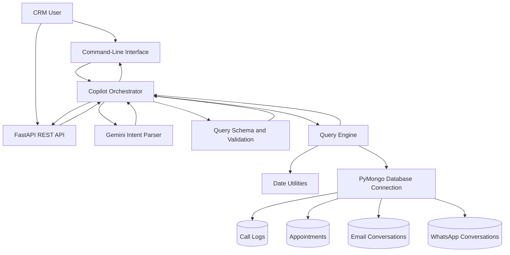

# RUNO CRM AI Copilot — Architecture

## 1. System Overview

RUNO CRM AI Copilot translates natural-language CRM questions
into controlled, read-only MongoDB queries.

The system separates natural-language interpretation from
database execution.

## 2. Architecture Diagram

## 3. Module Responsibilities

### api.py

Exposes the application through FastAPI.

Provides the home endpoint, health endpoint, and natural-language
question endpoint.

### cli.py

Provides an interactive command-line interface for entering
questions and viewing CRM results.

### intent_parser.py

Sends natural-language questions to Gemini and requests
structured intent information.

### schema.py

Defines the supported collections and query types.

### copilot.py

Coordinates the overall request.

It receives parsed intent, normalizes supported variations,
validates parameters, selects the appropriate query handler,
and returns the structured result.

### query_engine.py

Contains the predefined read-only CRM query functions.

It handles filtering, aggregation, sorting, and retrieval
against MongoDB.

### date_utils.py

Converts relative and custom date expressions into date
ranges suitable for database filtering.

### database.py

Manages MongoDB connectivity and provides access to the
four CRM collections.

## 4. Example Request Flow

User question:

"Show emails that were not delivered successfully."

Step 1: The CLI or API receives the question.

Step 2: Gemini identifies an email-status query.

Step 3: The copilot interprets undelivered email statuses
as failed and bounced.

Step 4: The copilot selects the approved email-status handler.

Step 5: The query engine retrieves matching records from MongoDB.

Step 6: The application returns the matching records and total.

For the original dataset, this query returns 324 records.

## 5. Controlled Execution

The application does not allow Gemini to execute arbitrary
database commands.

Instead, the copilot maps supported intent types to
predefined Python query functions.

Only approved function parameters are forwarded.

This keeps the natural-language layer separate from
database execution.

## 6. Date Handling

Supported date expressions include:

- Today
- Yesterday
- This week
- Last week
- This month
- Last month
- Last N days
- Custom start and end dates
- All time

The original CRM records are from March 2025.

Historical reference dates can be used in date utility tests
without changing the system clock or the stored dataset.

## 7. Data Collections

| Collection | Data category |
|---|---|
| call_logs_samples | Call logs |
| appointment_samples | Appointments |
| emails_sample | Email conversations |
| whatsapp_sample | WhatsApp Business conversations |

Each collection contains 500 records in the original dataset.

## 8. Testing Strategy

Database tests verify the query-engine functions directly.

Dynamic query tests verify variations in names, roles,
and custom date ranges.

Date tests verify relative and custom date handling.

Gemini-dependent tests verify intent interpretation and
end-to-end copilot behavior.

The Gemini-dependent tests are run separately to avoid
unnecessary API usage.
